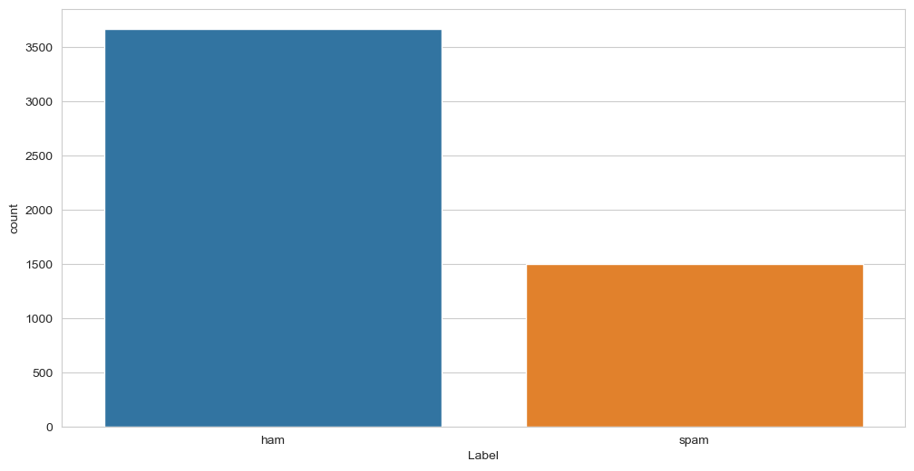
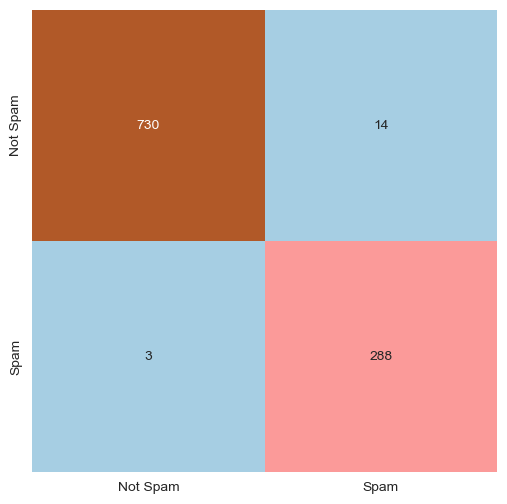
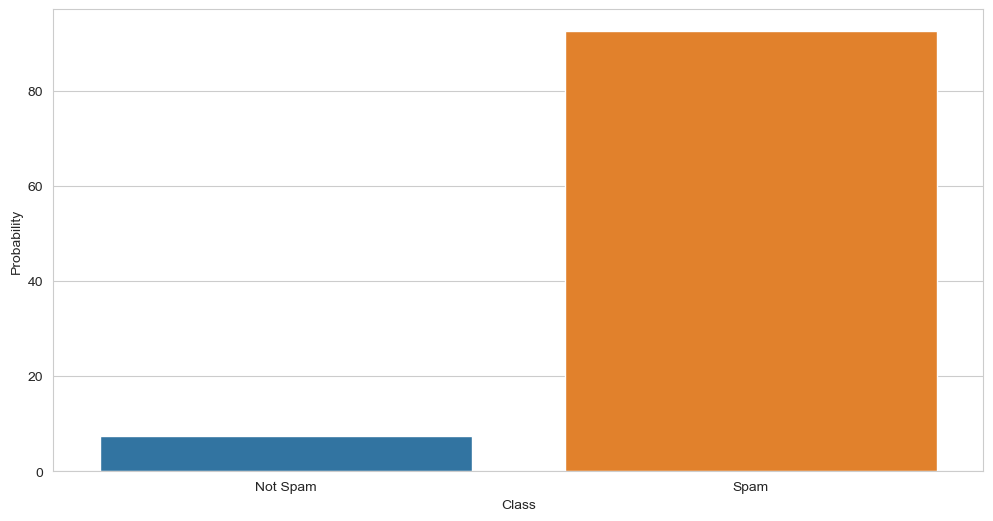

# Spam Email

Spam Email project for Python 3.10.8

## Applications

* [Miniconda](https://docs.conda.io/en/latest/miniconda.html "Miniconda download")
* [Visual Studio Code](https://code.visualstudio.com/download "Visual Studio Code download")
* [Jupyter Iteractive Extension for Visual Studio Code](https://marketplace.visualstudio.com/items?itemName=ms-toolsai.jupyter "Jupyter Extension for Visual Studio Code installation page")
* [ipykernel](https://pypi.org/project/ipykernel/ "ipykernel for Jupyter")

## Required Libraries

* [pandas](https://pandas.pydata.org/)
* [Matplotlib](https://matplotlib.org/)
* [seaborn](https://seaborn.pydata.org/)
* [Natural Language Toolkit](https://www.nltk.org/)
* [scikit-learn](https://scikit-learn.org/stable/)

## Project Framework

Code based off Syam Kakarla's [Spam Email Classifier](https://www.kaggle.com/code/syamkakarla/spam-mail-classifier "Spam Email Classifier by Syam Kakarla").

The goal of the project is to mark emails as "spam" or "not spam" based off the subject text.

### Theory

To predict the label of the instances based on learned relationship.

**Initial Population Classification**

The actual parameters for "spam" and "not spam" emails in the provided `spam_ham_dataset.csv`.

There are 1499 "spam" emails and 3672 "not spam" emails for a total of 5171 emails.

**Model Error Report**

Reports the accuracy of the model based off the training data.

**Model Evaluation Report**

Given the input, "You won 1000$ prize money in lottery. Click here to avail", the model evaluated the probability of this subject text being a spam email.

## Credits

Dat Nguyen - Creator

Alex Akoopie - Creator